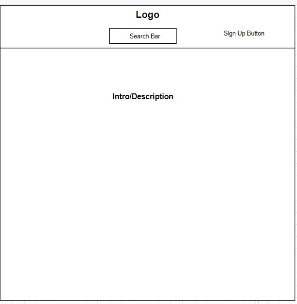
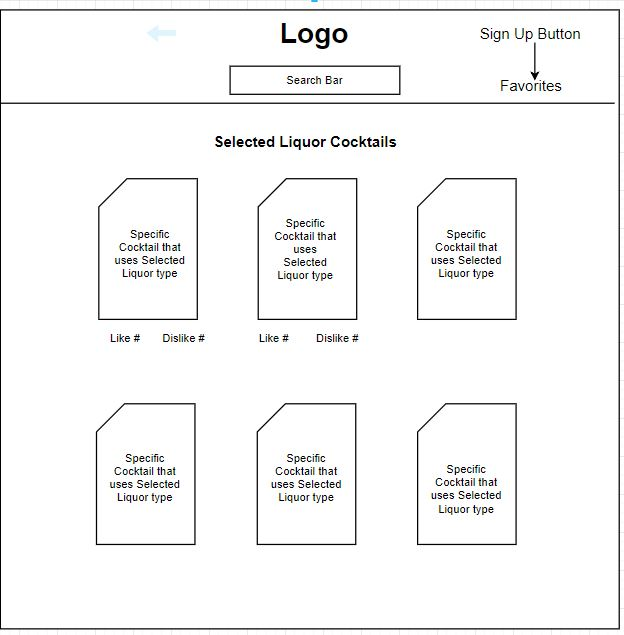

# Title of Project - TBD

Welcome to Project 2

## Description
A Favor-esque liquor delivery app where a user can order alcoholic beverages for delivery. Users will be able to find recipes for cocktails and order ingredients through our personal distribution service. Users will also be able to rate drinks as well as save favorites.

## Sketch
**Mockup of front page**

**Mockup of a search page**

## Technologies Used
HTML, CSS, JavaScript, jQuery, React, Tachyons, React-Particles, React-Tilt, MySQL, Express, Node, Sequelize
TheCocktailDB API
## Deployed Site
https://blueberry-pudding-93261.herokuapp.com/
